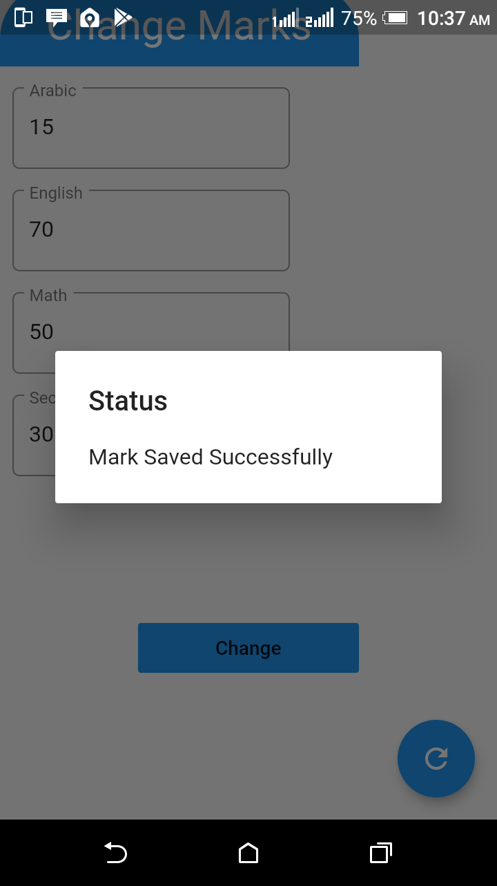
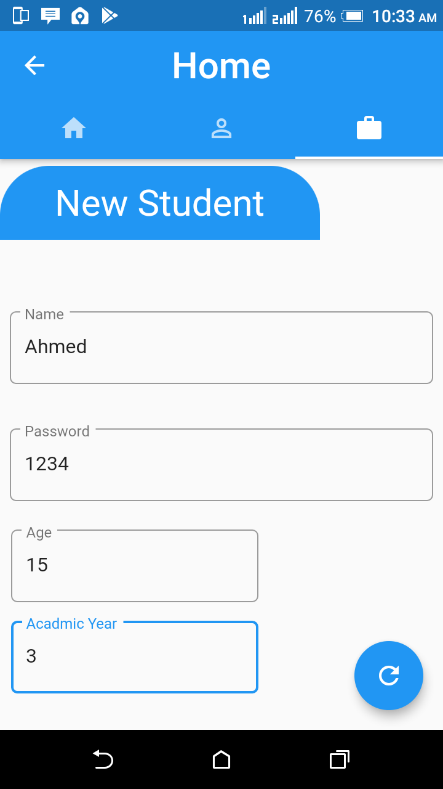
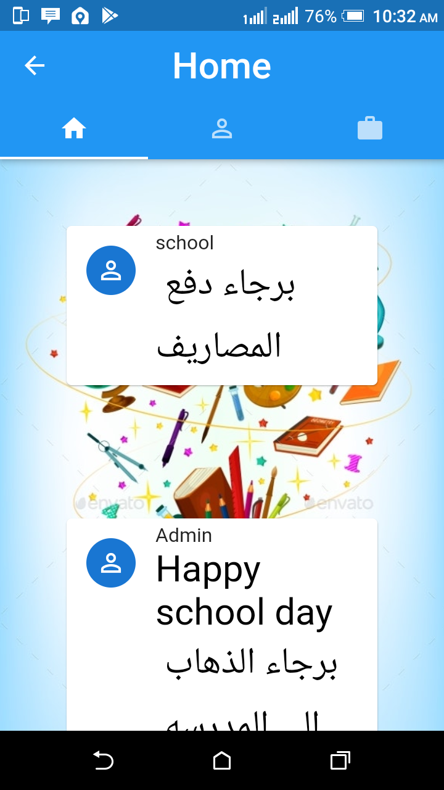
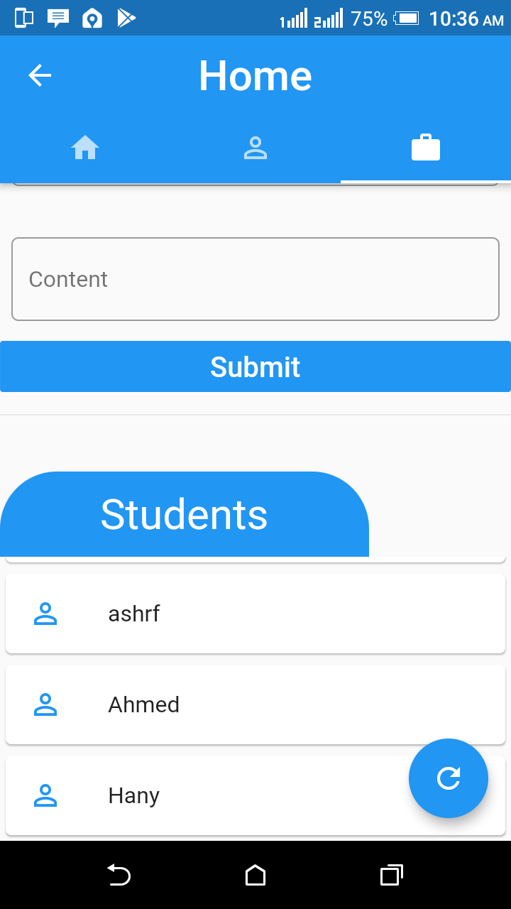
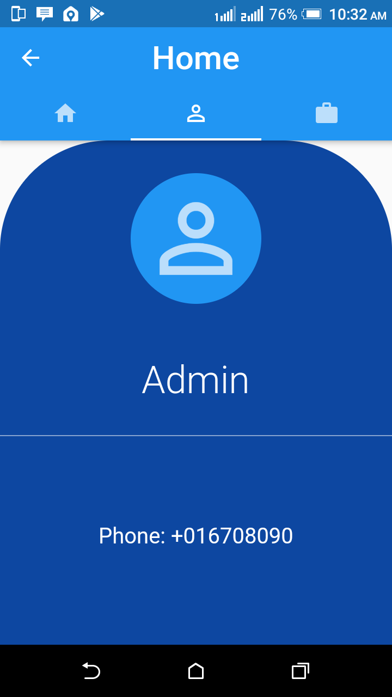
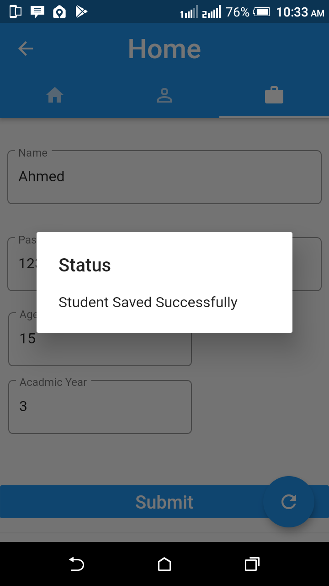
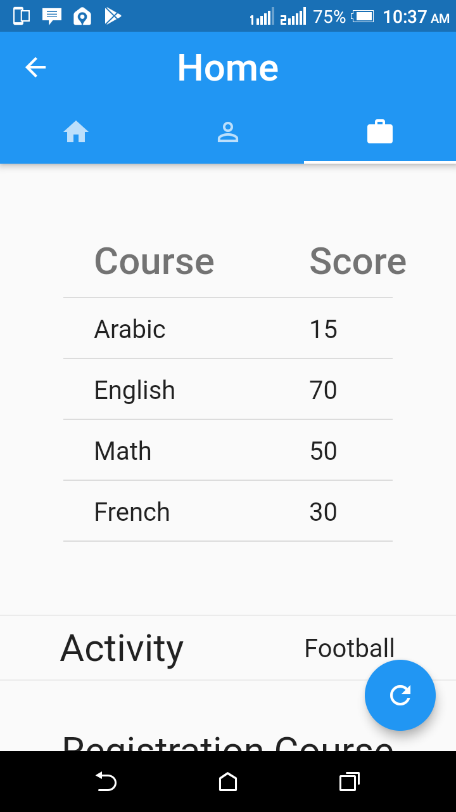
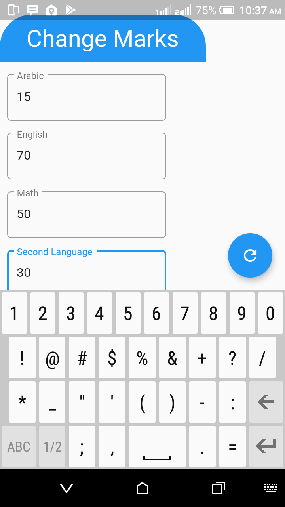
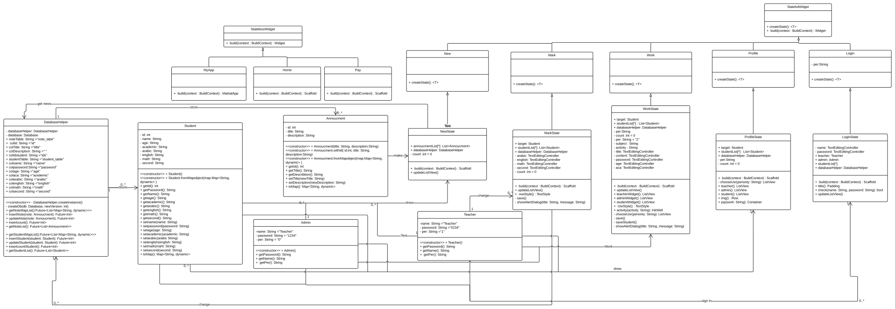

# school-system-flutter
## App
   |   |   |   |   |   |   |   |   |   |   |  

## Class Diagram
  

## Team members
* Mohamed Elesaily
* Mahmoud Ashraf
* Khalid Muhammad
* Mahmoud Swillam
* Mahmoud Benyamin
* Mohamed Hamada
* Hady Ashraf
* Mohamed Ramdan
